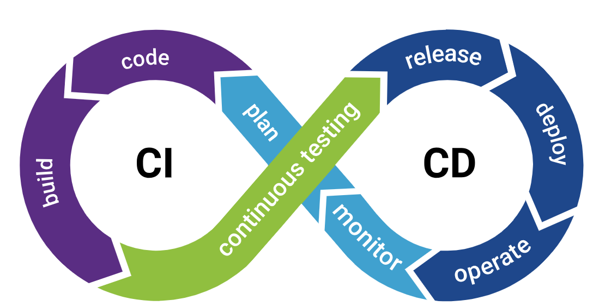

<p align="center">
  </a>
</p>

## 📝 Objetivo do Repositório

Este repositório tem como objetivo principal implementar e manter um fluxo de CI/CD robusto e alinhado às boas práticas de engenharia de software, garantindo que o processo de desenvolvimento seja seguro, rastreável e eficiente até a entrega em produção.

Entre os pontos de destaque, estão:

**Segurança desde a branch:** Políticas de proteção de branches, exigindo revisões obrigatórias antes do merge, além de validações automáticas (lint, testes unitários e testes de integração).

**Revisões de código:** Todo código precisa ser aprovado via pull request, assegurando qualidade, padronização e mitigação de riscos antes de ir para produção.

**Automação de pipeline CI/CD:** Execução automática de testes, análises estáticas de código, build e deploy contínuo para os ambientes de homologação e produção.

**Confiabilidade na entrega:** Somente alterações validadas e aprovadas passam para o pipeline de produção, reduzindo falhas e garantindo maior estabilidade.

O foco é disponibilizar uma estrutura que permita entregas contínuas e seguras, com visibilidade e controle total do ciclo de vida da aplicação, desde a fase de desenvolvimento até a publicação em ambiente produtivo.

---

## 📦 Estrutura do Projeto

```
/
├── .github/     # Código para fluxo de CI/CD
├── k8s/         # Arquivos de deploy no Kubernetes
├── src/         # Código-fonte principal
└── LICENSE      # Licença do projeto
└── README.md    # Documentação          
```